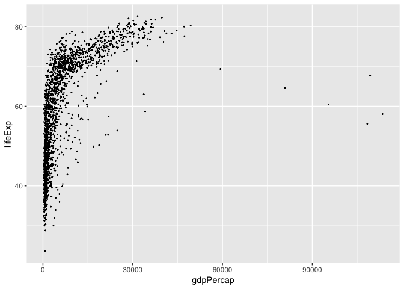
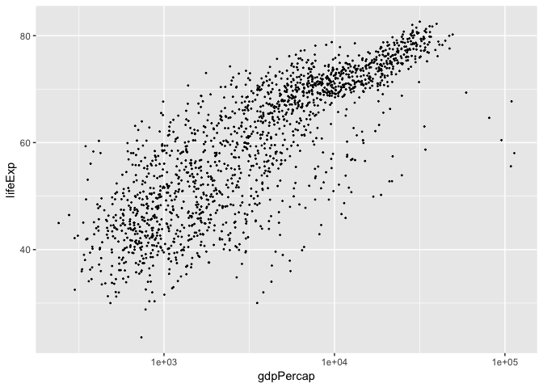
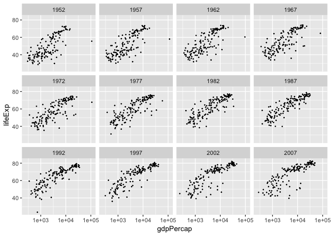
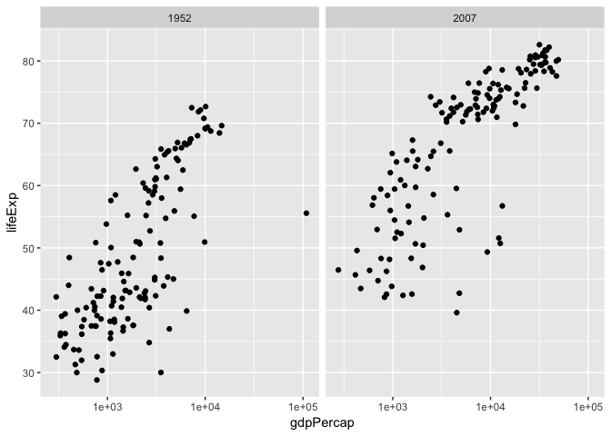
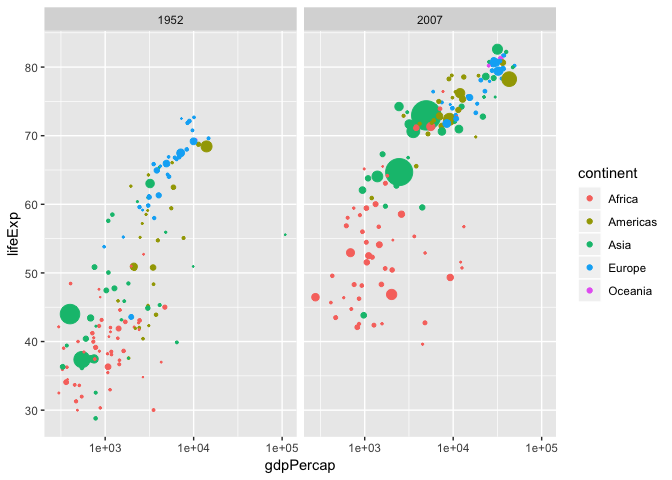
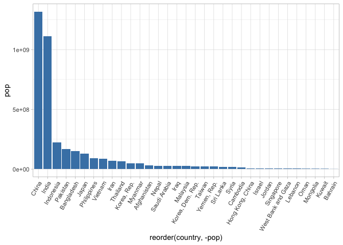
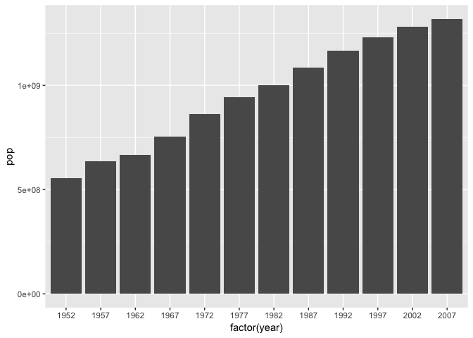
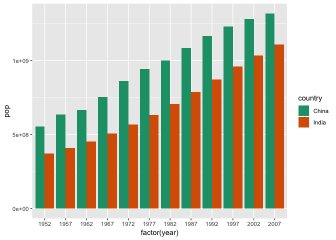

```r
library(tidyverse)
library(skimr)
library("RColorBrewer")
```

```r
#install.packages("gapminder")
```

```r
library("gapminder")
```

```
## Warning: package 'gapminder' was built under R version 3.4.2
```

```r
gapminder <- 
  gapminder::gapminder
```

1. Explore the data using the various function you have learned. Is it tidy, are there any NA's, what are its dimensions, what are the column names, etc.

```r
names(gapminder)
```

```
## [1] "country"   "continent" "year"      "lifeExp"   "pop"       "gdpPercap"
```

```r
gapminder
```

```
## # A tibble: 1,704 x 6
##    country     continent  year lifeExp      pop gdpPercap
##    <fct>       <fct>     <int>   <dbl>    <int>     <dbl>
##  1 Afghanistan Asia       1952    28.8  8425333      779.
##  2 Afghanistan Asia       1957    30.3  9240934      821.
##  3 Afghanistan Asia       1962    32.0 10267083      853.
##  4 Afghanistan Asia       1967    34.0 11537966      836.
##  5 Afghanistan Asia       1972    36.1 13079460      740.
##  6 Afghanistan Asia       1977    38.4 14880372      786.
##  7 Afghanistan Asia       1982    39.9 12881816      978.
##  8 Afghanistan Asia       1987    40.8 13867957      852.
##  9 Afghanistan Asia       1992    41.7 16317921      649.
## 10 Afghanistan Asia       1997    41.8 22227415      635.
## # ... with 1,694 more rows
```

```r
glimpse(gapminder)
```

```
## Observations: 1,704
## Variables: 6
## $ country   <fct> Afghanistan, Afghanistan, Afghanistan, Afghanistan, ...
## $ continent <fct> Asia, Asia, Asia, Asia, Asia, Asia, Asia, Asia, Asia...
## $ year      <int> 1952, 1957, 1962, 1967, 1972, 1977, 1982, 1987, 1992...
## $ lifeExp   <dbl> 28.801, 30.332, 31.997, 34.020, 36.088, 38.438, 39.8...
## $ pop       <int> 8425333, 9240934, 10267083, 11537966, 13079460, 1488...
## $ gdpPercap <dbl> 779.4453, 820.8530, 853.1007, 836.1971, 739.9811, 78...
```

2. We are interested in the relationship between per capita GDP and life expectancy; i.e. does having more money help you live longer on average. Make a quick plot below to visualize this relationship.

```r
gapminder %>% 
  ggplot(aes(x=gdpPercap,y=lifeExp))+
  geom_point(size=0.25)
```

<!-- -->

3. There is extreme disparity in per capita GDP. Rescale the x axis to make this easier to interpret. How would you characterize the relationship?


```r
gapminder %>% 
  ggplot(aes(x=gdpPercap,y=lifeExp))+
  geom_point(size=0.25)+
  scale_x_log10()
```

<!-- -->

4. This should look pretty dense to you with significant overplotting. Try using a faceting approach to break this relationship down by year.


```r
gapminder %>%
  ggplot(aes(x=gdpPercap, y=lifeExp))+
  geom_point(size=0.25)+
  scale_x_log10()+
  facet_wrap(~year)
```

<!-- -->

5. Simplify the comparison by comparing only 1952 and 2007. Can you come to any conclusions?

```r
gapminder %>%
  filter(year==1952 | year==2007) %>% 
  ggplot(aes(x=gdpPercap, y=lifeExp))+
  geom_point()+
  scale_x_log10()+
  facet_grid(~year)
```

```
## Warning: package 'bindrcpp' was built under R version 3.4.4
```

<!-- -->

6. Let's stick with the 1952 and 2007 comparison but make some aesthetic adjustments. First try to color by continent and adjust the size of the points by population. Add `+ scale_size(range = c(0.1, 10), guide = "none")` as a layer to clean things up a bit.

```r
gapminder %>%
  filter(year==1952 | year==2007) %>% 
  ggplot(aes(x=gdpPercap, y=lifeExp, color=continent, size=pop))+
  geom_point()+
  scale_x_log10()+
  facet_grid(~year)+
  scale_size(range = c(0.1, 10), guide = "none")
```

<!-- -->

7. Although we did not introduce them in lab, ggplot has a number of built-in themes that make things easier. I like the light theme for these data, but you can see lots of options. Apply one of these to your plot above.

```r
?theme_light
```

8. What is the population for all countries on the Asian continent in 2007? Show this as a barplot.

```r
gapminder %>%
  filter(year==2007, continent=="Asia") %>% 
  ggplot(aes(x=reorder(country, -pop), y=pop))+
  geom_col(fill="steelblue")+
  theme_light()+ 
  theme(axis.text.x = element_text(angle = 60,hjust=1))
```

<!-- -->

9. You should see that China's population is the largest with India a close second. Let's focus on China only. Make a plot that shows how population has changed over the years.

```r
gapminder %>%
  filter(country=="China") %>% 
  ggplot(aes(x=factor(year), y=pop))+
  geom_bar(stat="identity")
```

<!-- -->

10. Let's compare China and India. Make a barplot that shows population growth by year using `position=dodge`. Apply a custom color theme using RColorBrewer.

```r
gapminder %>%
  filter(country=="China" | country=="India") %>% 
  ggplot(aes(x=factor(year), y=pop, fill=country))+
  geom_bar(stat="identity", position="dodge")+
  scale_fill_brewer(palette = "Dark2")
```

<!-- -->

